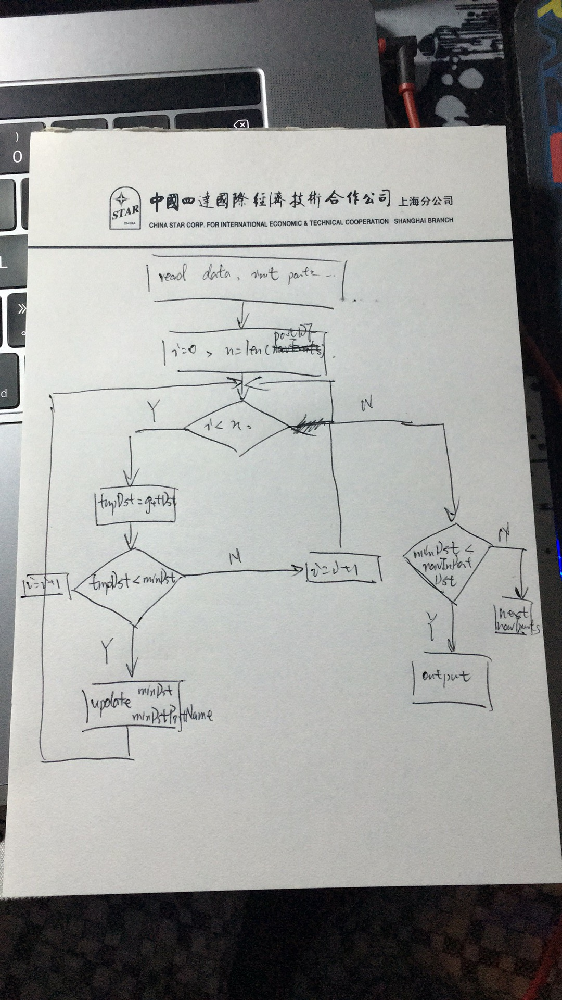

# absOrg
ABS original project

1. 对多边形仅仅用水域范围。

# 20170425:
徐老师，我已经把ABS给出6000+的码头数据与我们自己整理的码头数据进行了对比
其中：ABS有6121个；我们自己的有2894个。然后，相同的码头名称的数据有2769个，所以相同的占大多数。
我觉得使用ABS给出的码头数据作为“点港口”来进行，毕竟结果是给他们看的，这个静态数据也理应用他们给出的。

我们自己人工标定的码头中，我查看了一下东南亚部分的标定，由于那里的码头复杂，而且是我很久之前标定的我觉得准确性不高，所以决定不采用了。
目前多边形采用的数据是小谢给出的精确标定的16+3，（16：国内16个港口的水域坐标；3：纽约、新泽西、新加坡的水域信息）

现在的程序做法：
1. 先判断人工标定的“多边形港口”，找出在多边形内的停泊事件，并记录说明已经在多边形内出现过。

2. 再判断“点港口”，找出在范围内的停泊事件。
     做法：1° 对停泊事件进行筛选，找出没有在“多边形港口”内出现过的停泊事件
                2° 对停泊事件和每个“点港口”求地球两点之间的距离，并找出最小值minDst与对应的港口minDstPort。
                3° 若minDst小于20公里，则判断为该停泊事件在minDstPort内。

# 20170426:
对平均航速的求解方法：

	1.     由于平均航速与船舶静态数据中的maxDraught（船舶最大吃水深度）紧密相关。所以，在求平均航速时需要找到对应的吃水深度
	2.     以某一航段为例：若某船舶，起始港口为A，停靠港口为B。那么，根据起始时间Ta与结束时间Tb找出对应时间内的AIS数据中的动态数据与静态数据。找出，静态数据字段中draught的更新时间Tc，求出Tc与Tb之间的平均航速。
	3.     船舶的一个平均航速与一个draught对应。不用分析所有船舶，分析样本越多越好，不能混入脏数据。

ABS平均航速计算做法：
1° 根据停泊事件找出起始港A到停靠港B的航行时间段，即Ta -- Tb
2° 根据Ta -- Tb找到对应的静态数据，在对应的静态数据中，找到Tc为静态数据变更的时间段。
     （主要判断draught字段，若draught没有发生变化，此航段不继续进行下面的计算）
3° 对Tc -- Tb时间段内的AIS动态数据求得平均航速

平均航速的计算方法：
根据王晓敏给出的代码：她是直接用了AIS数据中对地航速的字段求得了加速度；而平均速度用的是距离除以时间得到。她将平均速度小于1节，加速度大于1节的不做考虑。只有平均速度大于1节且加速度小于1节的航段作为求平均航速的航段。 做法比较奇怪，需要修改，使用的参数可以参考

船舶匹配情况：
2108
2053

总共2108个imo匹配到2053，但是匹配到2173条mmsi

# 20170427:
1.生成表格：
    字段：IMO, Name, StartTime, EndTime, PortName, PortLon, PortLat;
    时间为开始停泊与结束停泊事件，码头为停靠码头
    若同一条船舶在同一港口内段时间内发生了连续的停泊，合并为一条。时间差可以取24小时。

# 20170430:
数据为根据2016年9月上半月跑出的结果

# 字段说明
IMO--船舶呼号，ABS给出
shipName--根据IMO匹配船讯网静态数据，船讯网静态数据内的船名
MMSI--船讯网静态数据中的MMSI
startTime--开始航行时间，A港口停泊事件中结束停泊的时间
startPortName--A港口港口名
startPortLon--A港口纬度
startPortLat--A港口纬度
endTime--结束航行时间，B港口停泊事件中开始停泊事件
endPortName--B港口港口名
endPortLon--B港口所在经度
endPortLat--B港口所在纬度
distance--航行距离，从离开A港口至到达B港口的时间内的航行距离
seaGoingTime--航行时间，从离开港口A至到达B港口的时间总和
portTime--A港口与B港口内总停泊时长
sailDraught--航行时的吃水深度，若此段为空则说明吃水深度有歧义，则不采用
avgSpeed--航行时的平均航速，若无吃水深度，不计算

取消了离开B港口时的吃水深度
理由：得出所有结果后我发现，时间序列上连续两个航段中，都能得到确定的吃水深度的情况少之又少，所以没有存在意义不大。
修改：因为离开A港口时的吃水深度也看作是航行时的吃水深度，取消了离开A、B港口时的吃水深度，增加了航行时的吃水深度sailDraught

# 20170509：

commite 20170509：
更新convertTimePortName.py：合并原来的ABSResualt2016.csv的文件中有起始港与终点港相同，且之间的航行距离小于40公里。
其实，这种停泊事件就是在一个港口内发生的，需要进行合并。convertTimePortName.py用于合并这些停泊事件

合并后的字段更新：
IMO--船舶呼号，ABS给出
shipName--根据IMO匹配船讯网静态数据，船讯网静态数据内的船名
MMSI--船讯网静态数据中的MMSI
TEU--船舶对应的TEU
startTime--开始航行时间，A港口停泊事件中结束停泊的时间，UTC时间
startPortName--A港口港口名
startPortLon--A港口纬度
startPortLat--A港口纬度
startPortingTime--在A港口停泊的时间
endTime--结束航行时间，B港口停泊事件中开始停泊事件，UTC时间
endPortName--B港口港口名
endPortLon--B港口所在经度
endPortLat--B港口所在纬度
endPortingTime--在B港口停泊的时间，单位：天
distance--航行距离，从离开A港口至到达B港口的时间内的航行距离，单位：海里
seaGoingTime--航行时间，从离开港口A至到达B港口的时间总和，单位：天
portTime--A港口与B港口内总停泊时长，单位：天
sailDraught--航行时的吃水深度，若此段为空则说明吃水深度有歧义，则不采用，单位：0.001毫米
avgSpeed--航行时的平均航速，单位：节

修改说明：
增加了在A港口与B港口分别的停泊时间
增加了TEU字段

# 程序说明：
1. 1-1.py
    1° 对人工标定的"多边形港口"进行判断
        利用跑出的停泊事件中的经纬度信息，判断该事件是否在多边形内；若存在于多边形内，标记并输出。
    2° 对非人工标定的"点港口"进行判断
        对没有在"多边形港口"内出现过的停泊事件进行判断，暂定以20公里为半径。若该停泊事件与码头
        的距离小于该距离，输出

2. ABSFunc.py
    1° 一些功能函数

3. avgSpeed.py
    获取船舶在平稳状态时的平均航速。
    思路：船舶的稳定状态，即在海上航行，航行速度相对较快且加速度很小的时候为航行稳定状态。

4. avgSpeedAddImoName.py
    对求出平均航速的数据，根据MMSI加上TEU、IMO、Name字段

5. avgSpeedPaintData.py
    获取给定TEU范围的平均速度，并计数。形成可以出概率分布的图的数据形式。

6. avgSpeedPaintDataOpt.py
    获取给定TEU范围的平均速度，并计数。把吃吹深度按0.5米为单位进行分组。

7. base_func.py
    用到的基础功能函数

8. bubbleData.py
    形成气泡图数据

9. calc.py
    根据ABSResult数据进行计算
    getTopTenPort函数：计算所有港口的停靠艘次
    getTopTenRoute函数：计算所有航线上的船舶艘次

10. checkPortName.py
    对比检查ABS给出的港口数据与我们自己的港口数据

11. checkShipName.py
    对比ABS给出的船舶与我们的船舶条数

12. convert_resulat.py
    转换停泊时间的结果的程序，在本次项目中用到当中的合并停泊时间的程序段

13. convertTimePortName.py
    转换ABSResult，把港口A--港口A的情况进行合并。合并规则：航行距离小于40公里且间隔时间小于24小时

14. getRouteData.py
    获取航线图数据

15. getSpecAIS.py
    筛选AIS数据

16. getStaticData.py
    从船讯网的.db文件中获取静态数据

17. getStaitSpec.py
    从船讯网的静态数据中，获取ABS需要的船舶静态数据

18. navAddImoName.py
    根据停泊时间与码头的位置关系表，得到ABS想要的数据格式

19. navEventsGetMerge.py
    合并停泊事件，合并规则：两个停泊事件之间时间间隔小于24小时，则进行合并

20. plotRouteData.py
    根据ABSResult数据，获取航线图数据

21. specMMSIAIS.py
    筛选AIS数据